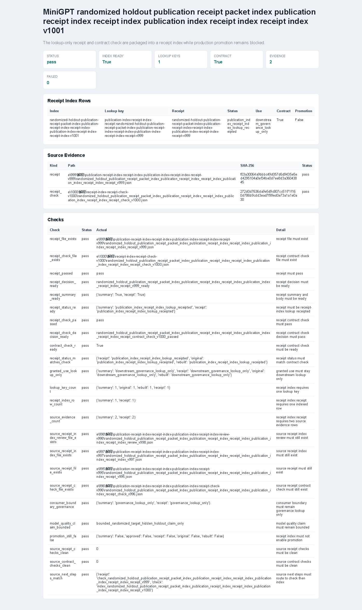

# v1001 运行截图与解释

本版生成 `randomized_holdout_publication_receipt_packet_index_publication_receipt_index_receipt_index_publication_index_receipt_index_receipt_index_v1001` 证据。它读取 v999 的 lookup-only receipt 和 v1000 的 contract check，把两者登记为一个新的 receipt-index-receipt 查询索引。

本版不训练模型，不改变 checkpoint，不扩大模型能力声明，也不允许 production promotion。它的作用是把“v999 receipt 已记录、v1000 已证明可重建”这一组证据变成后续治理模块可查的索引入口。

## 输入

- `e/999/解释/publication-receipt-index-receipt-index-publication-index-receipt-index-receipt-v999`
  - v999 downstream receipt，状态为 `publication_index_receipt_index_lookup_receipted`。
- `e/1000/解释/receipt-index-receipt-check-v1000`
  - v1000 contract check，证明 v999 receipt 可以从 v998 review 重新推导。

## 运行命令

```powershell
python scripts\build_randomized_holdout_publication_receipt_packet_index_publication_receipt_index_receipt_index_publication_index_receipt_index_receipt_index_v1001.py --receipt e\999\解释\publication-receipt-index-receipt-index-publication-index-receipt-index-receipt-v999 --receipt-check e\1000\解释\receipt-index-receipt-check-v1000 --out-dir e\1001\解释\receipt-index-v1001 --require-index-ready --require-lookup-ready --force
```

输出关键结果：

- `status=pass`
- `index_ready=True`
- `lookup_scope=downstream_governance_lookup_only`
- `lookup_key_count=1`
- `receipt_status=publication_index_receipt_index_lookup_receipted`
- `granted_use=downstream_governance_lookup_only`
- `source_evidence_count=2`
- `contract_check_ready=True`
- `promotion_ready=False`
- `passed_check_count=24`
- `failed_check_count=0`

## 截图



截图来自 Playwright MCP 打开的 HTML 报告页面。页面显示 `Status=pass`、`Index ready=True`、`Lookup keys=1`、`Failed=0`，并展示 receipt index rows、source evidence 和 checks 三段证据。

## 输出文件

`e/1001/解释/receipt-index-v1001/` 下保存：

- JSON：完整结构化报告。
- CSV：索引行。
- TXT：运行摘要。
- Markdown：可读报告。
- HTML：截图页面。

本版目录采用短名 `receipt-index-v1001`，是为了规避 Windows 路径长度限制；报告标题和文件名仍保留完整语义。

## 验证

- `python -m py_compile ...`
  - 新增核心模块、artifact、CLI、测试、常量和包级导出均可编译。
- `python -m pytest tests\test_randomized_holdout_publication_receipt_packet_index_publication_receipt_index_receipt_index_publication_index_receipt_index_receipt_index_v1001.py -q -o cache_dir=runs/pytest-cache-v1001-focus`
  - `4 passed`。
- `python -B scripts\check_source_encoding.py --out-dir runs\source-encoding-hygiene-v1001`
  - `status=pass`、`bom_count=0`、`syntax_error_count=0`、`compatibility_error_count=0`。
- `git diff --check`
  - 通过。
- `python -m pytest -q -o cache_dir=runs/pytest-cache-v1001`
  - `2376 passed in 279.76s`。

## 解释

v1001 的新增索引行使用 `publication-index-receipt-index-receipt:` 命名空间。它只授予 `downstream_governance_lookup_only`，并保留两条 source evidence：v999 receipt 与 v1000 check。这样后续 review/receipt 层可以按 lookup key 找到这组证据，而不是重新扫描历史目录。

`promotion_ready=False` 和 `approved_for_promotion=False` 仍然是硬边界。v1001 没有把治理证据解释为模型质量提升，只证明这条 publication receipt index receipt 链路可查、可复核、未越权。
