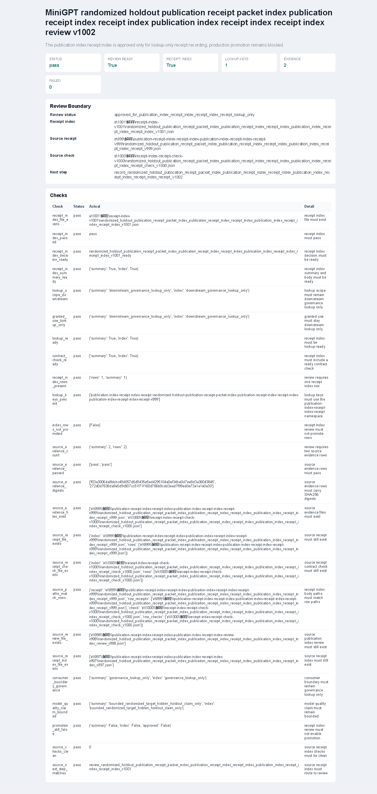

# v1002 运行截图与解释

本版生成 `randomized_holdout_publication_receipt_packet_index_publication_receipt_index_receipt_index_publication_index_receipt_index_receipt_index_review_v1002` 证据。它读取 v1001 的 receipt-index-receipt index，做 lookup-only review，确认这份索引可以进入下一层 receipt 记录。

本版不训练模型，不修改 checkpoint，不扩大模型质量声明，也不做 production promotion。它只复核 v1001 索引是否仍然是可查、可复核、无推广权限的治理证据。

## 输入

- `e/1001/解释/receipt-index-v1001`
  - v1001 receipt-index-receipt index，包含一条 `publication-index-receipt-index-receipt:` lookup row 和两条 source evidence。

## 运行命令

```powershell
python scripts\review_randomized_holdout_publication_receipt_packet_index_publication_receipt_index_receipt_index_publication_index_receipt_index_receipt_index_v1002.py e\1001\解释\receipt-index-v1001 --out-dir e\1002\解释\review-v1002 --require-review-ready --require-receipt-index-ready --force
```

输出关键结果：

- `status=pass`
- `review_ready=True`
- `review_status=approved_for_publication_index_receipt_index_receipt_index_receipt_lookup_only`
- `receipt_index_row_count=1`
- `source_evidence_count=2`
- `lookup_key_count=1`
- `receipt_index_ready=True`
- `lookup_ready=True`
- `contract_check_ready=True`
- `promotion_ready=False`
- `passed_check_count=25`
- `failed_check_count=0`

## 截图



截图来自 Playwright MCP 打开的 HTML 报告页面。页面显示 `Status=pass`、`Review ready=True`、`Receipt index=True`、`Failed=0`，并展示 review boundary 和 checks 表。

## 输出文件

`e/1002/解释/review-v1002/` 下保存：

- JSON：完整 review report。
- CSV：逐项检查结果。
- TXT：运行摘要。
- Markdown：可读报告。
- HTML：截图页面。

## 验证

- `python -m py_compile ...`
  - 新增核心模块、artifact、CLI、测试、常量和包级导出均可编译。
- `python -m pytest tests\test_randomized_holdout_publication_receipt_packet_index_publication_receipt_index_receipt_index_publication_index_receipt_index_receipt_index_review_v1002.py -q -o cache_dir=runs/pytest-cache-v1002-focus`
  - `6 passed`。
- `python -B scripts\check_source_encoding.py --out-dir runs\source-encoding-hygiene-v1002`
  - `status=pass`、`bom_count=0`、`syntax_error_count=0`、`compatibility_error_count=0`。
- `git diff --check`
  - 通过。
- `python -m pytest -q -o cache_dir=runs/pytest-cache-v1002`
  - `2382 passed in 381.27s`。

## 解释

v1002 的主要边界是 review，而不是 receipt 记录。它检查 v1001 索引的 lookup scope、granted use、source evidence digest、source evidence 文件存在性、body/row 路径一致性、source review 和 source receipt index 文件存在性，以及 no-promotion 字段。

本版把 v1001 的“索引已生成”推进为“索引已批准进入 lookup-only receipt 记录”。它仍然不证明模型能力提升，只证明治理证据链更稳。
