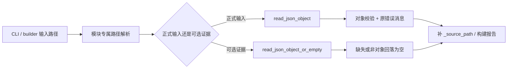

# v1271 治理报告 JSON 读取器收敛：在严格与宽容契约之间做可证明的去重

## 一、本版目标、问题与明确边界

v1271 的目标不是再增加一条报告链，而是修整现有治理代码中反复出现的一段基础设施：从路径读取 UTF-8-SIG JSON、确认顶层结构为对象、转换成普通 `dict`，再在部分入口上补 `_source_path`。这段逻辑本身不复杂，但散落在 benchmark scorecard、training scale、training portfolio 和 promoted training scale 等多个稳定模块中。复制的直接代价不是少写几行，而是错误处理、BOM 支持和对象形状约束可能随时间分叉；当某个副本修复、其他副本未同步时，调用方会得到不一致的行为。

本版明确不做四件事。第一，不碰科学线训练、缓存 checkpoint、实验 verdict 和 `decide()` 判定逻辑。第二，不把全仓数百个历史实验 loader 一次性机械替换，因为这些模块具有版本冻结和历史复现实义，巨大 diff 的风险高于收益。第三，不删除旧公开函数名，也不改变目录输入、文件输入和 `_source_path` 的既有输出契约。第四，不把“目标批次清零”写成“全仓债务清零”；报告中仍公开显示 496 个相似历史读取形状。

这条路线来自 v1268-v1270 的深度工程保养：v1268 先减少重复 CI 执行，v1269 把静态分析债务砍半并建立 shrink-only 门，v1270 拆开高变更频率的 CI hygiene 巨型职责。v1271 继续遵循同一原则：选择仍活跃、风险可控、测试覆盖较好的治理区域，做合同保持的真实收敛，而不是新建功能。

## 二、迁移前的两种语义不能混为一谈

初看九个公开 loader 都像下面这样：

```python
payload = json.loads(path.read_text(encoding="utf-8-sig"))
if not isinstance(payload, dict):
    raise ValueError("... must be a JSON object")
payload = dict(payload)
payload["_source_path"] = str(path)
```

这类入口是严格契约。输入文件必须存在，JSON 语法错误必须抛出，顶层数组或标量也必须以明确的 `ValueError` 失败。严格失败很重要，因为这些文件是治理链的正式输入；把 `[]` 静默变成 `{}` 会让后续代码把“结构损坏”误判为“字段缺失”，从而丢失真正的根因。

定向测试第一次运行时又发现，`training_scale_handoff.py` 和 `training_scale_promotion.py` 内部还有第二类读取器。它们读取的是可选的旁路证据：路径不存在时返回 `{}`，顶层不是对象时也返回 `{}`，但 JSON 语法损坏仍会抛出。这是宽容契约，服务于“证据可能尚未生成”的工作流。若只移除 `import json` 而不识别这组隐式依赖，就会产生 `NameError`；若直接强行换成严格 helper，又会改变业务语义。

因此，本版不是把所有读取都塞进一个万能函数，而是把语义分成两个名字清楚的入口：

```python
read_json_object(path, description="training scale handoff")
read_json_object_or_empty(path)
```

前者负责正式治理输入，后者负责可选旁路证据。函数名本身就是调用方的意图说明，使代码审查者不用展开实现就能知道失败策略。

## 三、共享工具的输入、输出与异常模型

`read_json_object` 已存在于 `src/minigpt/report_utils.py`。它接受 `str | Path` 和一个用于错误消息的 `description`，以 `utf-8-sig` 读取内容。这个编码既能读取普通 UTF-8，也能透明消费带 BOM 的 Windows 生成文件。解析结果不是字典时，它抛出：

```text
<description> must be a JSON object
```

九个 loader 传入各自原来的描述文本，所以异常类型和异常消息保持不变。成功时返回新的普通字典，调用方再按原逻辑添加 `_source_path`。路径定位函数仍留在原模块中，因为不同报告的默认文件名和目录回退顺序属于模块自身契约，不属于通用 JSON 解析职责。

本版新增的 `read_json_object_or_empty` 接受 `str | Path | None`。`None`、不存在的路径或非对象顶层都返回空字典；合法对象返回普通字典；JSON 解码错误不被吞掉。这里故意没有加入 `description`，因为它不是严格 schema guard，也不会自行构造对象形状错误。该设计精确复现两个内部 helper 的原行为，没有扩大容错范围。

调用链可以概括为：



这张图最关键的点不是两个函数，而是路径解析仍归原模块所有、字节读取和顶层对象策略归共享工具所有。职责边界由输入语义决定，不按“看起来代码相似”盲目合并。

## 四、本批九个模块及其链路角色

`benchmark_scorecard_comparison.py` 与 `benchmark_scorecard_decision.py` 负责读取 scorecard 和 comparison，形成基准结果对比与后续决策。它们的输入是正式报告，必须严格拒绝数组。

`training_scale_run_comparison.py` 与 `training_scale_run_decision.py` 读取训练规模 run 及其 comparison。后者还会尝试反查来源 run；该旁路失败时原本允许回落，因此保留了异常捕获。迁移后静态门发现异常元组仍写着 `json.JSONDecodeError`，本版改为显式导入 `JSONDecodeError`，避免为了一个类型名继续保留整个 `json` 模块依赖。

`training_scale_handoff.py` 读取 workflow，并在内部按 workflow 引用加载可选 decision。workflow 是正式输入，使用严格 helper；decision 是可选上游证据，使用宽容 helper。这个模块正是“两种语义不能合并成一个默认行为”的代表。

`training_scale_promotion.py` 读取正式 handoff，同时按 handoff 路径读取可选 scale run、batch 和 variant 证据。正式入口严格，可选 artifact 宽容。它的测试覆盖了 completed、review、缺失变体证据、suite guard、batch regression 和 HTML escaping，因此很适合作为契约保持的回归证明。

`training_portfolio_comparison.py`、`promoted_training_scale_comparison.py` 和 `promoted_training_scale_decision.py` 分别读取 portfolio、promotion index 与 promoted comparison。它们沿着训练规模治理链向上聚合，只改变底层对象读取方式，不改变字段计算、排序、决策阈值或渲染输出。

## 五、dedup checker 如何从旧工具演化而不另造治理链

仓库在 v1140 已有 `report_loader_dedup.py` 和 `generate_report_loader_dedup_v1140.py`，当时只保护五个模型能力回归模块。v1271 没有复制一份 `v1271` checker，而是在同一个检查器中把目标分为两组：

- `LOCATE_AND_READ_MIGRATED_MODULES`：原来的五个模块，要求同时使用统一路径定位与对象读取；
- `GOVERNANCE_READER_MIGRATED_MODULES`：本批九个模块，只要求统一对象读取，因为它们各自的路径解析契约不同。

`MIGRATED_MODULES` 仍是两组拼接后的兼容总表。每一行新增 `requires_locate_helper`，检查逻辑据此决定是否要求 `locate_upstream_report`。这样避免了一个常见反模式：为了让检查器形式统一，反过来扭曲被检查模块的合理职责。

checker 继续检查目标文件存在、所需 helper 已导入、目标内不再出现 `json.loads + read_text + utf-8-sig` 的私有副本。报告新增两组计数，并把过时的 v1141 next step 改为 `continue_opportunistic_loader_migration_without_bulk_rewrite`。输出文件名仍保留 `report_loader_dedup_v1140`，这是对既有 CLI/产物命名的兼容，不代表证据仍停留在 v1140。

全仓 `private_loader_copy_count=496` 与目标 `migrated_private_loader_copy_count=0` 必须一起阅读。前者是债务可见性，后者才是本版验收范围。这个设计防止报告用局部成功掩盖仓库历史规模，也防止为了追求一个漂亮的全局零值而触碰冻结科学实验。

## 六、测试如何证明“去重但不改合同”

第一层是共享工具测试。测试用 `utf-8-sig` 写入对象，证明 BOM 输入仍能读取；再用数组、缺失路径和 `None` 验证宽容 helper 的空字典回落。严格 helper 的原测试继续断言非对象会抛出带描述的 `ValueError`。

第二层是九个公开 loader 的参数化契约测试。测试把同一个带 BOM 的 `[]` 依次交给九个 loader，并逐一断言原来的错误消息，例如 `training scale workflow must be a JSON object`。这不是只检查 helper 被 import，而是从公开入口证明调用方可观察行为保持不变。

第三层是模块原有回归测试和 guard 组件直接测试。定向集合覆盖 benchmark comparison/decision、training scale handoff/promotion/run comparison/run decision、portfolio comparison、promoted comparison/decision，以及四个 guard 优先级与归一化场景，共 `116 passed`。第一次运行出现的 27 个失败没有被修改期望值消除，而是暴露并修复两个内部读取器对旧 `json` 导入的依赖。

第四层是静态分析 ratchet。首次静态运行发现 `training_scale_run_decision.py` 仍引用 `json.JSONDecodeError`，给出一个新 F821。最终通过显式类型导入修复，结果回到 `current_issue_count=271`、`baseline_issue_count=271`、`new_issue_count=0`。基线文件未更新，因此不存在“把新错误记进基线就算通过”的降级。

第五层是源码结构证据。最终 dedup report 为 `status=pass`、`failed_count=0`，14 个目标行均为 `migrated`，九个本批模块中的私有读取副本为 0。Playwright 打开 HTML 后确认这些字段可见，页面控制台错误与警告均为 0，并把全页截图归档到 `f/1271/图片/`。

## 七、维护收益、风险与后续策略

本版的直接收益是九个正式治理入口共享同一个 BOM、JSON 解析和对象形状实现；两个宽容内部入口共享另一个精确定义的实现。以后如果需要修复读取编码、补充路径类型支持或审计非对象输入，只需在共享工具和契约测试中处理一次。

更重要的收益是把“严格”与“宽容”从隐含代码形状提升为命名契约。维护者看到 `read_json_object_or_empty` 就知道缺失证据不是硬失败；看到 `read_json_object` 就知道输入损坏必须阻断。这降低了后续报告链把结构错误误当缺数据的概率。

风险主要有两个。其一，九个文件经过 ruff format 整理，diff 中包含既有长行换行；本版用完整定向测试和静态门控制这种可读性改动的风险。其二，源码形状 checker 不是 AST 级证明，理论上可能漏掉另一种写法；因此它只作为防回贴的结构门，真正行为仍由公开入口测试保护。

全套工程健康门第一次运行时还给出一个更细的信号：`over_warning_count` 从 v1270 的 21 变成 22。门本身仍是绿色，因为 `training_scale_handoff.py` 只有 514 行，未超过 800 行硬限制；但深度保养不能只满足“没失败”，还要观察趋势。该文件在 HEAD 中原为 477 行，经过 ruff 对旧长行的标准化后跨过 500 行警戒线。这不是可以靠忽略格式或提高阈值解决的问题，因为它同时包含路径加载、执行、artifact 汇总、suite guard、clean-batch-review guard、summary 和 recommendation 多类职责。

本版因此把 suite 与 clean-batch-review 两组守卫构造提取到 `training_scale_handoff_guards.py`。主模块通过别名保持内部调用结构，公开 API 不变；主文件从观察到的 514 行降为 413 行，新组件为 113 行。新组件不是“拆出去就不管”，而是同时加入 ruff strict paths 和 mypy scope，scope floor 从 19 收紧到 20，最终 `diagnostic_count=0`。file-size ratchet 随之回到 `over_warning_count=21`。这一步体现了保养版本的标准：绿色门只是下限，若趋势因本版变差，就在同一版把职责边界修好。

后续不建议立即追逐剩余 496 个历史副本。合理路线是：当某个活跃模块因缺陷、类型收紧或职责拆分被真实触及时，把同语义的一小组 loader 一起迁移，并要求现有测试、错误合同和 evidence report 同步通过。若某组 loader 属于科学线冻结实验，则除非用户明确授权，不应仅为数字下降而改写。

## 八、一句话总结

v1271 把九个活跃治理报告的 JSON 对象读取收敛为两种语义清晰、测试可证明的共享契约，并把跨过警戒线的 handoff 守卫职责拆成严格类型组件；它保留 496 个历史副本的真实可见性，没有跨入科学线，也没有用基线更新或提高阈值掩盖回归。
