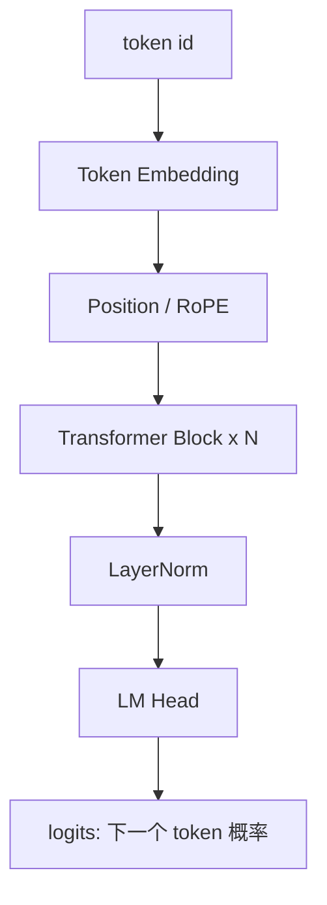

# aiproj 项目通俗说明

这个项目一句话说：**它不是在做一个 ChatGPT 规模产品，而是在做一台透明的 MiniGPT 实验台，用很小的模型把 tokenizer、Transformer、训练、微调、评估、蒸馏、推理优化和证据治理全部拆开看清楚。**

## 总体流程

```mermaid
flowchart LR
  A["原始文本 / 合成任务"] --> B["Tokenizer<br/>文字变 token id"]
  B --> C["Dataset<br/>切成 x/y 训练批次"]
  C --> D["MiniGPT<br/>Embedding + Transformer + LM Head"]
  D --> E["Loss<br/>预测下一个 token"]
  E --> F["Optimizer<br/>反向传播更新参数"]
  F --> G["Checkpoint<br/>模型权重 + tokenizer + config"]
  G --> H["Evaluation / Generation<br/>样本、holdout、scorecard"]
  H --> I["Reports / Manifests<br/>JSON/MD/HTML/截图/CI"]
  I --> J["判断<br/>能不能声称能力提升"]
```



## 最通俗例子：让小模型学会反转字符串

项目会构造这种训练样本：

```text
Rabc=cba\n
```

意思是：

- `R` 是指令，表示 reverse，也就是反转。
- `abc` 是输入。
- `=` 后面是答案。
- `cba` 是反转结果。
- `\n` 是结束标记。

所以这条样本可以读成：

```text
训练输入: Rabc=
目标输出: cba
```

这个数据构造逻辑在 `src/minigpt/sft_corpus.py` 里。项目不只做反转，还会做 copy、sort、shift-left 等小任务：

```text
Cabc=abc\n      # copy
Rabc=cba\n      # reverse
Sbac=abc\n      # sort
Labcd=bcda\n    # shift-left
```

这些任务看起来小，但非常适合学习模型原理，因为答案明确、可自动评估、能区分“记住训练样本”和“真的学会规则”。

## 每一步输入和输出

| 步骤 | 输入 | 做什么 | 输出 |
|---|---|---|---|
| 数据构造 | `Rabc=cba\n` 这类文本 | 生成训练样本和 heldout 样本 | `SftCorpus` |
| Tokenizer | 字符串 | 把字符映射成数字 | `[id_R, id_a, id_b, ...]` |
| Dataset | token 序列 | 切成 `x` 和 `y` | `x=当前片段`，`y=下一个 token` |
| 模型 | `x` | masked self-attention 只看左边上下文 | 每个位置的 logits |
| Loss | logits + y | 计算预测错多少 | cross entropy / KL |
| 训练 | loss | 反向传播更新权重 | checkpoint |
| 生成 | prompt: `Rabc=` | 一个 token 一个 token 续写 | `cba\n` |
| 评估 | heldout prompt | 看未知输入能否做对 | exact match / KL / scorecard |
| 治理 | 评估产物 | 写报告、截图、manifest、CI | 可复核证据链 |

## 模型内部机理

MiniGPT 的核心结构在 `src/minigpt/model.py` 里，可以简化成：



它每次不是“整体理解一句话”，而是做一个更基础的任务：**根据左边所有 token，预测右边下一个 token**。

例如模型看到：

```text
Rabc=
```

它会输出一组概率：

```text
c: 0.80
a: 0.05
b: 0.04
...
```

如果正确答案的下一个 token 是 `c`，loss 就低；如果它猜成 `a`，loss 就高。训练就是不断让正确 token 的概率变高。

## 为什么这个项目有价值

### 1. 原理透明

这个项目不是只调用一个黑盒 API，而是把 GPT 的关键部件自己实现出来：

- tokenizer 怎么把文字变成数字；
- dataset 怎么把文本切成训练批次；
- attention 怎么只看左边上下文；
- loss 怎么衡量预测错误；
- optimizer 怎么更新参数；
- generation 怎么一个 token 一个 token 续写；
- evaluation 怎么判断模型是否真的学到了东西。

这对理解 GPT 原理非常有价值。

### 2. 实验真实，不只写报告

项目后期做了很多真实的小模型实验，例如：

- SFT instruction-following；
- LoRA fine-tuning；
- RoPE position embedding；
- KV cache incremental generation；
- DPO preference tuning；
- reward model + best-of-N；
- speculative decoding；
- knowledge distillation；
- distillation under uncertainty。

这些不是空泛名词，而是在小模型上真实跑出结果、写入报告、截图和测试。

### 3. 会承认负结果

一个成熟的实验项目不应该只报告“成功”。这个项目比较有价值的一点是：它会认真记录负结果。

例如 v1172 的 knowledge distillation 实验发现：

```text
确定性任务里 teacher 接近 one-hot，
dark knowledge 几乎不存在，
蒸馏没有明显收益，
把等价计算还给 student 继续训练反而更好。
```

这比强行宣称“蒸馏一定有用”更诚实，也更像真实 AI 工程。

### 4. 工程治理强

每次实验不只生成模型，还会生成：

- `checkpoint.pt`
- `tokenizer.json`
- `train_config.json`
- `metrics.jsonl`
- `run_manifest.json`
- `run_manifest.svg`
- Markdown 报告
- HTML 报告
- 截图证据
- CI 验证

这让结果可以被复核，而不是靠一句“我感觉模型变好了”。

### 5. 适合学习 GPT 背后的工程链路

这个项目不能和真正 ChatGPT 比规模，但它能帮助理解 ChatGPT 背后的基础机制：

- token 预测；
- embedding；
- self-attention；
- position encoding；
- loss；
- supervised fine-tuning；
- preference optimization；
- reward model；
- distillation；
- inference acceleration；
- evaluation governance。

## 以 v1173 蒸馏实验为例

v1173 问的问题是：

```text
teacher 给 student 的 soft probability，到底有没有额外信息？
```

普通 hard label 只告诉模型：

```text
这次答案是 a
```

但是 soft teacher 可以告诉模型：

```text
a: 0.45
b: 0.25
c: 0.15
d: 0.10
e: 0.05
```

这就不是单个答案，而是一个概率形状。模型不只知道 `a` 最可能，也知道 `b` 比 `e` 更像答案。

v1173 的输入是一个明确构造出来的概率分布任务：

```text
上下文 G= 可能输出:
a: 0.45
b: 0.25
c: 0.15
d: 0.10
e: 0.05
```

它比较几种训练方式：

| 方式 | 含义 |
|---|---|
| `scratch_hard` | student 只看少量 hard sample |
| `teacher_argmax_hard` | teacher 只给最可能答案 |
| `teacher_soft` | teacher 给完整概率分布 |
| `label_smooth` | 泛化的平滑标签 |
| `shuffled_teacher` | 打乱 teacher 的非最大概率结构 |
| `oracle_true_P` | 理想上界，直接用真实分布 |

结果里有几个关键数字：

```text
teacher_soft KL: 0.050
scratch_hard KL: 4.476
teacher_argmax_hard KL: 3.516
label_smooth KL: 1.298
shuffled_teacher KL: 2.416
oracle_true_P KL: 0.002
```

KL 越低越好。通俗解释：

- 只用少量 hard label，student 学得很差。
- teacher 只给 argmax，也不够。
- teacher 给完整 soft distribution，student 几乎追到 teacher ceiling。
- label smoothing 有帮助，但不如真实 teacher distribution。
- 打乱 teacher 的概率结构后明显变差，说明 soft 概率结构本身真的有信息。

这就是 v1173 的结论：

```text
在不确定任务里，teacher 的完整概率形状真的有价值。
但这不是魔法，只是 teacher 用更多样本先学到了分布，
再把分布压缩传给 student。
```

## 这个项目最终在做什么

它现在最准确的定位是：

```text
MiniGPT from scratch
+ 小模型能力实验台
+ AI 工程证据治理系统
```

它的核心价值不是“训练出了多强的大模型”，而是：**把 AI 模型从数据到训练到评估到证据声明的全过程，做成一个透明、可复核、可迭代的工程样板。**

## 一句话总结

这个项目的价值在于：用小模型把大模型工程的核心机制拆开、跑通、验证、记录，并且诚实地区分“模型真的变强了”“只是报告更完整了”“实验结果其实是否定的”。
